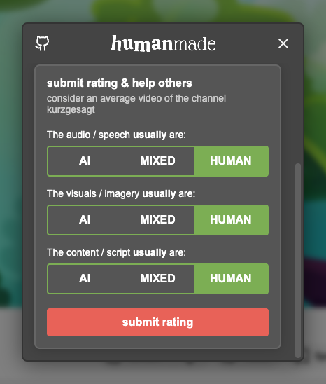
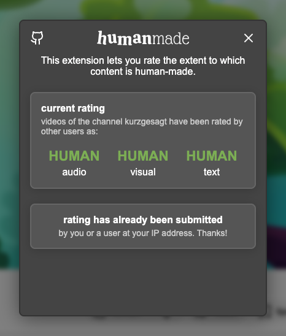

# humanMade __

A browser extension to crowdsource the labeling of AI-generated content on YouTube. Help to highlight channels made by humans for humans.

## features

- adds an icon to YouTube channel pages to indicate whether the channel is labeled as human-made
- allows users to submit labels for channels they believe are human-made

__
__
__

## installation

- download the extension for your browser:
  - [chrome](https://chrome.google.com/webstore/detail/humanmade/cfplkgejblmldlnpcgghomjbgmfbibjo)
  - [firefox](https://addons.mozilla.org/en-US/firefox/addon/humanmade/)

### contribute

- feel free to reach out if you find issues or have suggestions

Have a great day, 
Yours, Robin

